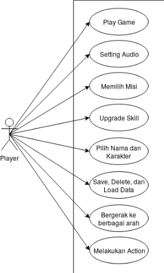

# Attis_Odyssey

## Latar Belakang
Isu lingkungan merupakan salah satu isu yang paling banyak diperbincangkan di masa pemanasan global saat ini. Banyak cara yang telah diupayakan untuk memperlambat pemanasan global dan mengantisipasi dampak yang diakibatkannya, misalnya dengan bermunculan gerakan-gerakan go green. Akan tetapi, masih banyak orang yang kurang peduli dengan terjadinya pemanasan global.
Pada saat ini, generasi millenials dan gen-Z memiliki kecenderungan yang tinggi menghabiskan waktu menggunakan gadgetnya untuk bermain sosial media dan games. Oleh karena itu, perlu adanya media kreatif berupa games bertema lingkungan untuk meningkatkan kesadaran publik terhadap permasalahan yang ada pada saat ini, terutama pada kalangan millenials dan gen-Z.

## Tujuan
Mengenalkan berbagai jenis tanaman kepada pemain untuk membuat pemain peduli terhadap lingkungannya.

## Genre
3D, RPG, Adventure

## Story
Tokoh utama adalah seorang murid ahli tanaman yang dikirim ke sebuah desa, di desa ini penduduknya hampir tidak ada yang mengerti tentang tanaman yang menyebabkan desa ini gersang. Tugas tokoh utama adalah membuat penduduk desa mengerti betapa pentingnya tanaman untuk lingkungan hidup mereka, untuk merealisasikan itu tokoh utama harus meneliti tentang tanaman-tanaman yang ada di sekitar desa.

## Ruang Lingkup
Games ini ditujukan untuk kalangan Millenials dan Gen-Z yang berusia di antara 17-35 tahun.

## Dokumentasi
### Use Case Diagram

### Class Diagram

### Activity Diagram

